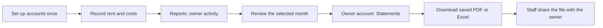

# Staff workflow for owner reporting

Research date: 7 September 2026. This is research from DoorLoop's official help guides and their embedded screen examples, not an authenticated DoorLoop product audit.

Nestory is used by company staff. Owners are managed records and receive a report file through the company's usual communication channel.

## What DoorLoop does

| Job | Documented interaction | Useful pattern for Nestory |
| --- | --- | --- |
| Set up accounts | Defaults are provided. An account opens its transaction register. Extra accounts are added when needed. | Keep COA as occasional setup, with drill-through to activity. [Guide](https://support.doorloop.com/en/articles/6170414-chart-of-accounts-overview) |
| Record rent | Choose a lease and receive payment. The tenant and property's deposit account default; charges can be allocated automatically or selected manually. | Keep everyday language and useful defaults in the payment form. [Guide](https://support.doorloop.com/en/articles/6162667-receive-a-payment-on-a-lease) |
| Record a paid cost | One expense form includes Pay from account, Category, property, amount, and optional unit or extra lines. Unpaid bills have a separate payment step. | Preserve the distinction between the funding account and the expense category. [Guide](https://support.doorloop.com/en/articles/6076135-create-an-expense) |
| Review a statement | Period/property/owner filters sit on the report. Owner groups begin collapsed; staff expand a summary or detail view and export PDF, Excel, or CSV. | Start with selection and a short result; show details on demand and make downloads easy to find. [Guide](https://support.doorloop.com/en/articles/8160274-owner-statement-report) |
| Pay an owner | A separate wizard selects recipients, checks account information, reviews available funds, and chooses a payment method. Its account-review step is skipped when unnecessary. | Keep distribution separate from reporting. A report's net movement must not become an assumed payout. [Guide](https://support.doorloop.com/en/articles/8421185-record-an-owner-distribution) |

DoorLoop's newer reporting release also documents combined multi-property owner summaries and formatted exports. That is a future comparison point, not a promise that Nestory can already consolidate official statements. [Reporting V2 release](https://support.doorloop.com/en/articles/14489492-what-s-new-doorloop-reporting-v2-version-9-2-0)

## Updated Nestory flow

The direct route for an existing official file is **Reports → Official owner statements → choose owner/property/month → Download PDF or Excel**.

The account has three views:

- **Summary:** balances, distribution availability, items to resolve, and account operations.
- **Activity:** recorded transactions, with source details available on expansion.
- **Statements:** saved files first; preparation and correction controls below, followed by collapsed revision history.

Month, property, and owner stay selected between views. Entering through Statements keeps that task when choosing a register row, even if the account has issues. The row does not invent a statement readiness status from an account balance.

## Required financial behavior

- Official downloads continue to reference retained artifacts by their existing identifiers. The UI does not regenerate official files from a live report.
- An absent file is not offered as a download. Incomplete artifacts and changed activity are clearly marked; superseded statements remain identifiable.
- Close, publish, resume, reopen, and correction actions retain their existing authorization, validation, and audit behavior. Preparation is immediately visible when there is no statement.
- Unknown distribution availability remains unavailable. COA categories do not establish permission to distribute funds.
- Staff sharing is an external manual step. This change introduces no owner login, portal, invitations, email sending, scheduled reporting, or payment integration.

## Implementation scope and verification

The local implementation is isolated on `codex/simplify-owner-reporting-flow`, based on finance integration commit `df410bcd63308da2179b1ed50640afc718de1b29`. It changes report navigation and the presentation of owner account and statement information. It does not change database schema, accounting calculations, or financial action handlers.

UI verification must cover scoped links and filters, visible downloads, missing/incomplete/superseded/stale states, and the existing role restrictions. A component preview uses synthetic records and is not evidence of hosted financial correctness or successful production downloads.

Verified locally: 27 tests across the account, close, route, and report-catalog suites; TypeScript; focused ESLint; UI copy; 50/50 route-discoverability checks; and 59/59 route-coverage checks. Browser checks covered the Reports entry, selecting an owner, preserving scope between views, expanding transaction detail, and current/stale/missing statement states. The preview is served from the ignored `output/owner-reporting-preview` directory on port 4317 and imports the changed application components.

The full production build, authenticated hosted deployment, real artifact downloads, and financial mutations were not exercised for this UI change. The main checkout remains clean at `cf4925c625993ee9580f1e954a0c8e9dd54d9a66`.

## Combined-candidate integration checks

The frozen handoff patch `22291179f31c1a64cd8003ce857c688962fe5ab5c4932f24a1b34df9dd75e086` was applied to `codex/finance-chart-pilot-integration` after verifying all 11 source hashes and a clean apply check. The source worktree was not edited.

Interaction regressions exposed and corrected four presentation issues: route navigation now resets the displayed scope filters, leaving Summary unmounts its operation dialog, required correction evidence stays visible inside the expanded preparation form, and a retained statement from an older closed revision is marked for review until its replacement is published. No artifact identifiers, financial handlers, calculations, or schema were changed by this reporting integration.

Fresh integration verification: 34 tests in five focused suites and TypeScript passed. Tests cover actual route scope arguments, report-only staff link denial, preserved PDF/Excel artifact links, missing/incomplete/stale/superseded statements, reclosed-but-not-republished revisions, and the interaction regressions above. This is component and route-boundary evidence; authenticated browser, full combined application, database, and release verification belong to the coordinating task's final checkpoint.
