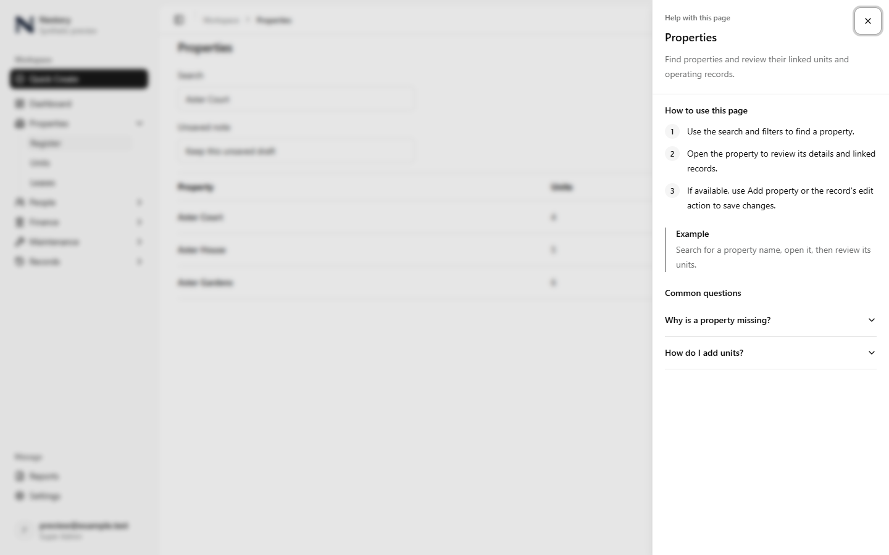
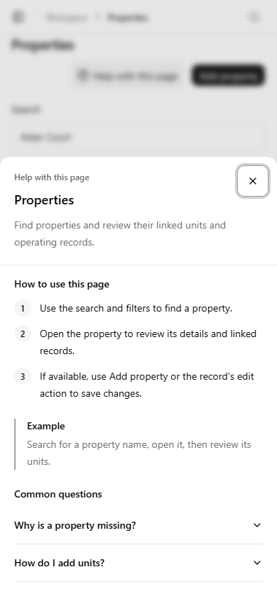
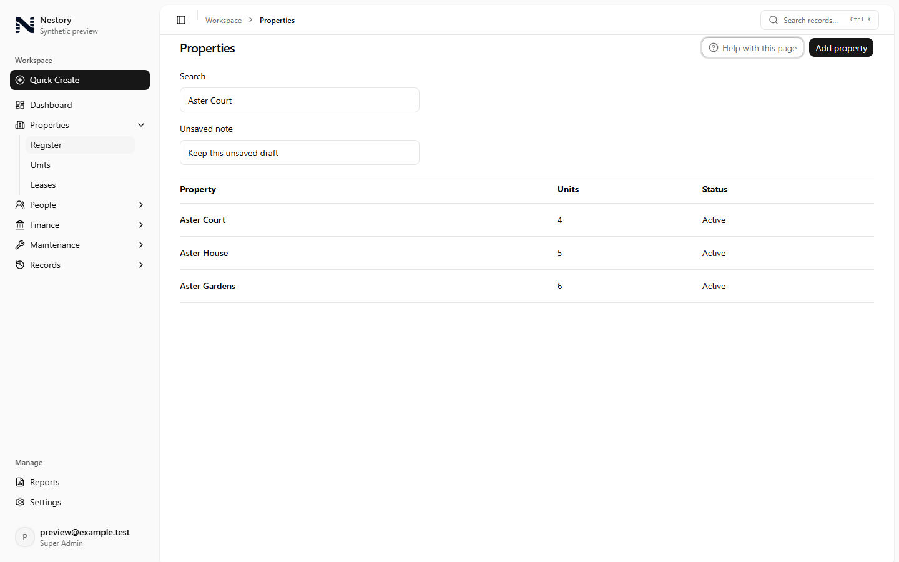
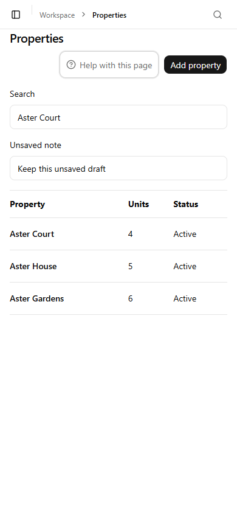
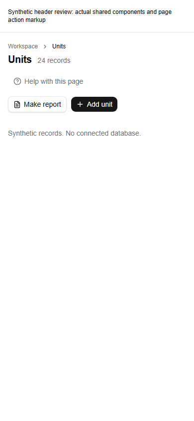
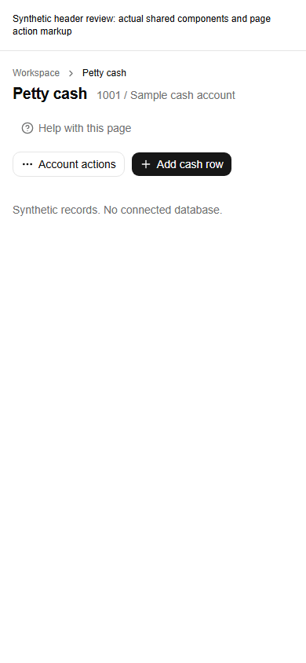

# Page help previews

These screenshots show the actual shared AppShell, PageHeader, and PageHelp components in a local preview using synthetic records. No customer data or connected database was used. The Next.js development indicator was hidden for capture.

| Desktop, 1440 × 900 | Mobile, 390 × 844 |
| --- | --- |
|  |  |
|  |  |

Browser checks passed at both sizes: three steps, dialog labeling, keyboard focus containment, Escape dismissal, focus return, preserved form values, URL filters and application scroll position, no horizontal overflow, a 44px close control, and zero axe violations within the help dialog. Lease help switches to deposit guidance without navigating; a subsequent Units page opens Units guidance.

Validation passed: 111 tests across help, shared layout/navigation, permission navigation, settings tabs, and dashboard suites; the final header adjustment passed another focused run of 49 tests. TypeScript noEmit, repository ESLint excluding the ignored generated preview output, affected-file ESLint, UI copy verification, secret scan, and whitespace review passed.

The release coordinator also verified the Units and Petty cash multi-action headers at 320px, 390px and 1440px. The original unconstrained action group clipped Add unit and Add cash row on phones. The group now wraps within the available header width; every action is visible and clickable, and Help still returns focus after Escape. Desktop geometry is unchanged.

| Units at 390px | Petty cash at 390px |
| --- | --- |
|  |  |

These additional header previews use the actual shared WorkspacePage/PageHeader components and the pages' action markup with synthetic callbacks. They do not exercise customer data or financial actions.

Full release checks and exact-head CI evidence are maintained in the PR description. Authenticated hosted write-based checks were not performed. This change has no database, permission, accounting, or customer-record writes. Report detail guidance remains for the reporting owner through the documented component API.
