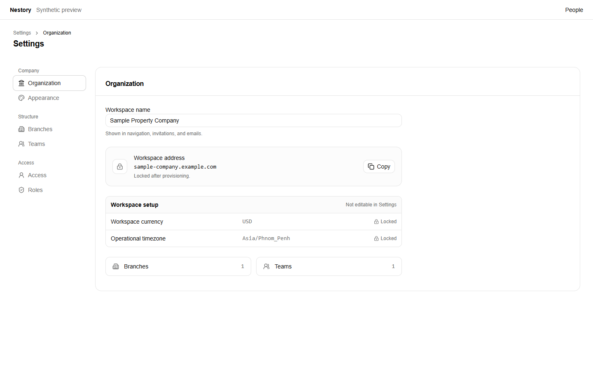
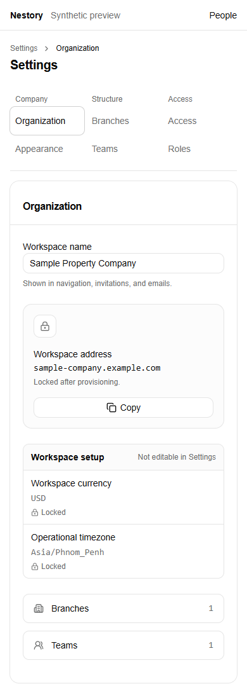
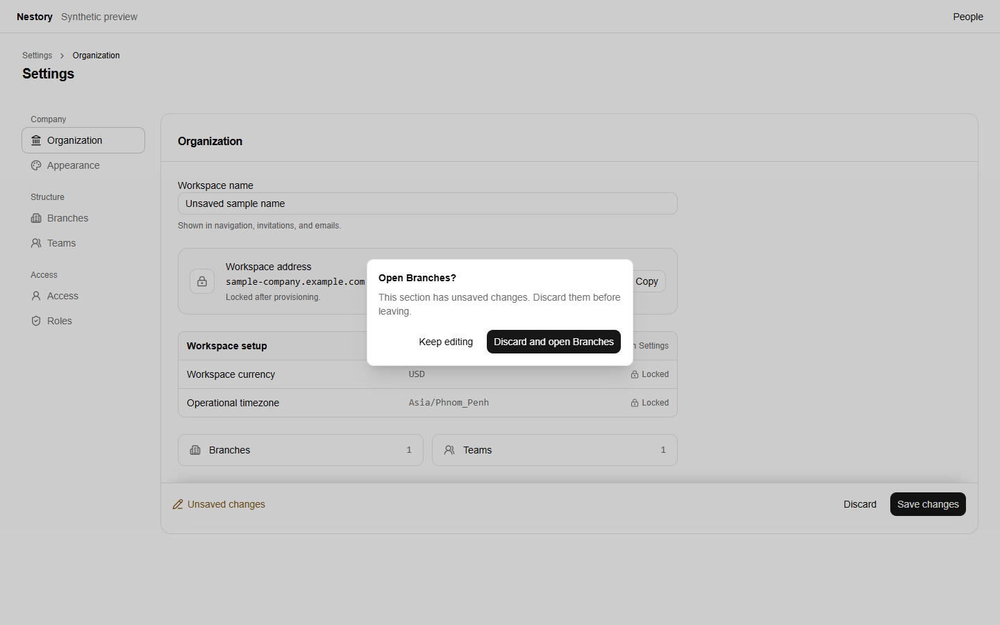
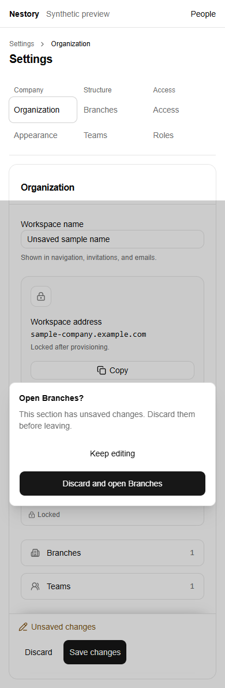

# Settings navigation previews

Synthetic desktop (1440×900) and mobile (390×844) previews use the actual SettingsShell, SettingsSectionNav, OrganizationIdentityEditor, draft hook, save bar, and navigation guard. Example company values, actions, and routing are local stubs. No account, hosted login, database, or customer records are connected. The app header is a synthetic preview header; these are not hosted screenshots. Help is supplied by the existing shared PageHeader integration when PR #203 is integrated; this change adds no second Help implementation.

Run from the repository root with installed dependencies:

    node docs/previews/settings-navigation/serve.mjs
    node docs/previews/settings-navigation/verify.mjs

The preview binds only to 127.0.0.1:4329. Browser requests outside that host are blocked. Generated evidence goes to ignored output/playwright/settings. Verification covers six visible settings destinations, mobile 44px navigation targets, no horizontal overflow, preserved edits after context-link and refresh cancellation, native Back cancellation and confirmed traversal, unchanged real history entries, Forward navigation, failed-save retry, zero dialog axe violations, and no browser page errors.

Native Back/Forward interception is feature-detected and limited to cancelable same-origin navigations. Browsers without that capability retain ordinary history behavior; full-document departures and refresh use the browser's beforeunload warning. No extra history entries, history patches, local draft storage, or fake navigation destinations are added to the application.
