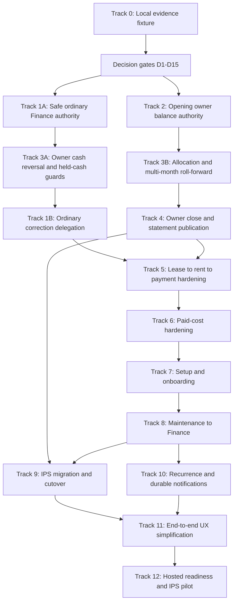

# IPS Operational Readiness Implementation Plan

> **For agentic workers:** REQUIRED SUB-SKILL: Use `superpowers:subagent-driven-development` (recommended) or `superpowers:executing-plans` to implement this plan task-by-task. Steps use checkbox (`- [ ]`) syntax for tracking.

**Goal:** Make Nestory trustworthy for IPS's daily finance, owner reporting, property operations, migration, recurring work, and controlled production pilot through twelve complete business workflows.

**Architecture:** Preserve Nestory's checked-RPC, immutable-source, organization-scoped architecture. Establish financial authority before presentation: granular role capabilities, evidence-backed opening balances, canonical owner-event allocation, multi-month roll-forward, revisioned close, and frozen statement publication. Extend outward through rent, paid-cost, setup, maintenance, migration, recurrence, UX, and hosted proof without treating local or CI success as production evidence.

**Tech Stack:** Next.js App Router, React, TypeScript, Supabase Auth/PostgreSQL/RLS/RPC/Storage/pg_cron, Zod, Vitest, pgTAP, Playwright, PDF and Excel report exporters, Vercel.

## Global Constraints

- Preserve all twelve user milestones. Recurring generation, durable notifications, and the production pilot are required deliverables, not deferred exclusions.
- One organization membership continues to have exactly one of the five fixed roles. Add granular capabilities inside that model; do not create a generic permission engine.
- Finance Manager receives only ordinary operational authority. Super Admin retains access management, structural lease/rent configuration, unlock, exceptional correction, and policy authority.
- Expense submission remains an already-paid-cost evidence workflow, never accounts payable or an unpaid vendor-bill workflow.
- Every material mutation remains organization-scoped, exact-decimal, payload-idempotent, RLS-protected, checked by an RPC, and serialized against the affected financial month.
- Reversals and corrections append evidence and lineage. They never rewrite or delete original financial history.
- Owner Statement publication may consume only an authoritative closed revision. It must never invent an opening balance, allocation, or ending balance inside a report loader.
- USD remains the only supported currency until a separately approved currency expansion. Nevertheless, balance and close keys include currency so authority is not structurally ambiguous.
- Historical rent recovery remains selected-month explicit. Migration tooling must make missing adjacent months visible and require intentional selection.
- Recurring maintenance must create durable future task instances. Notifications must be server-owned and durable; browser timers are not delivery proof.
- Preserve the dense, quiet, table-first authenticated operating model. UX work follows validated workflows and removes friction without replacing operational authority with presentation logic.
- Secrets from `.env.local`, `.env.docker`, `.vercel`, and `supabase/.temp` must never enter source, documentation, reports, screenshots, or agent messages.
- Do not contact or mutate hosted Supabase, Vercel, email, DNS, production storage, or real IPS data until the Hosted Mutation Approval Boundary is satisfied.
- Use test-driven development for every implementation task: failing contract, observed failure, minimal implementation, focused pass, regression pass, review, then commit.

---

## Objective And Non-Goals

This program replaces module-by-module completion with complete business stories:

1. Finance Manager can operate safely.
2. Opening owner balances are authoritative.
3. Owner balances roll forward and reconcile.
4. Owner Statements are immutable and trustworthy.
5. Lease-derived rent settles correctly across real scenarios.
6. Paid costs complete approval, effect, and reversal correctly.
7. Owner/property/unit/tenant/lease setup supplies downstream authority once.
8. Maintenance hands complete cost evidence to Finance.
9. IPS cutover imports are explicit, resumable, and reconciled.
10. Recurring work and notifications are durable automation.
11. End-to-end UX is simplified using proven operator journeys.
12. The exact hosted release is proven through a controlled IPS pilot.

This program does **not** add accounts payable, vendor-bill scheduling, payroll, tax, treasury, bank reconciliation, a chart of accounts, journals, trial balance, multi-role memberships, custom ACLs, arbitrary workflow engines, or automatic import of DoorLoop's entire history. Those boundaries must remain visible in UI copy and operator documentation.

## Current Evidence Baseline

The branch baseline is `codex/ips-operational-readiness`. The compact local fixture is complete through commit `48d0eef` and proves a repeatable starting state without claiming hosted readiness.

| Evidence | Current result |
| --- | --- |
| Local reset and fixture | PASS; three properties, ten units, five current leases, four tenant invoices, six maintenance tasks, five expense submissions |
| Fixture contract | PASS; 40/40 assertions, including exactly one unresolved Garden Court rent exception |
| Full pgTAP suite | PASS; 31 files, 952 assertions |
| Database lint and advisors | PASS; no schema errors and no error-level advisor findings |
| TypeScript and ESLint | PASS |
| Application tests | PASS; 178 Vitest files, 1,277 passed, one pre-existing skip; 22/22 demo-tool tests |
| Route and copy contracts | PASS; 47/47 routes, zero prohibited narration occurrences |
| Build | PASS with placeholder environment; existing multiple-lockfile root warning remains |
| Five-role browser fixture | PASS 5/5 with a unique seeded story for each fixed role |
| Hosted Supabase, Vercel, email, backup, and real IPS data | Not proven by the compact fixture and must remain reported as unverified until Track 12 |

The current repository truth also establishes these gaps:

- `src/lib/auth/capabilities.ts` gives Finance Manager read/review authority but leaves `canManageFinanceOperations` false; ordinary payment, owner-cash, petty-cash, recovery, and report workflows are therefore coupled to Super Admin controls.
- Current reports are only Monthly Owner Activity and Unit Profit and Loss. The production report catalog does not publish Owner Statement.
- `financial_month_locks` is a mutable operational time gate, not close authority. There are no close headers, close revisions, frozen statement snapshots, or publication lineage.
- `src/features/reports/data/owner-statement.ts`, `owner-statement-input.ts`, and `src/features/finance/property-cash.ts` are useful historical prototypes but are not authoritative production publication paths. They must be replaced or explicitly retired after canonical close data exists.
- Tenant payment and approved-expense reversal paths exist. Owner invoice payments and property withdrawals lack symmetrical reversal lineage, and ordinary correction delegation lacks a downstream held-cash safety guard.
- Maintenance recurrence is metadata/filtering only. Current reminders are browser timers active only while the relevant page is open.
- Historical rent recovery generates one selected completed month and never fills adjacent missing months.

## Decision Register

D1-D14 are approved IPS accounting and role decisions. D15 remains pending until IPS selects a notification channel; implementers may prepare the provider-neutral outbox but may not activate external delivery before that choice and Track 12 verification.

| ID | Decision | Recommended default | Status |
| --- | --- | --- | --- |
| D1 | Owner balance components | Store separate authoritative components: IPS-held owner cash, owner due to IPS, IPS due to owner, and security-deposit custody. Derive available withdrawal; do not store one unexplained scalar balance. | **Approved — IPS approved the recommended default on 2026-08-09.** |
| D2 | Opening balance dimensions | One evidence-backed opening component per organization, property, owner, currency, effective date, and balance component, with submitter, approver, reason, document/reference, and append-only correction lineage. | **Approved — IPS approved the recommended default on 2026-08-09.** |
| D3 | Ownership interval semantics | Use half-open intervals `[started_on, ended_on)` so a transfer date belongs to exactly one roster. Reject overlap or incomplete allocation. | **Approved — IPS approved the recommended default on 2026-08-09.** |
| D4 | Event-to-owner allocation | Allocate cash events using settlement/event date and the effective ownership roster, except events with an explicit checked owner identity. Persist the allocation used rather than recomputing history from today's ownership. | **Approved — IPS approved the recommended default on 2026-08-09.** |
| D5 | Ownership transfer treatment | Do not silently move existing receivables, held cash, deposits, expenses, or fees. Require explicit transfer instructions per component when a transfer crosses unsettled balances. | **Approved — IPS approved the recommended default on 2026-08-09.** |
| D6 | Management fee earning point | Preserve the current explicit occurrence at rent-obligation/invoice generation unless IPS confirms fees are earned on collection or at close. Never infer the value as a statement plug. | **Approved — IPS approved the recommended default on 2026-08-09.** |
| D7 | Direct-owner rent | Record it as tenant settlement and owner-held value, not IPS-held cash. Include it in owner activity while excluding it from IPS available withdrawal. | **Approved — IPS approved the recommended default on 2026-08-09.** |
| D8 | Owner cash terminology | Keep owner invoice payment, owner reimbursement/contribution, and owner distribution/withdrawal as distinct event types with separate checked workflows. | **Approved — IPS approved the recommended default on 2026-08-09.** |
| D9 | Deposit beneficiary | Keep deposit custody separate from operating cash and allocate beneficial ownership explicitly at close; never treat it as property income or withdrawable owner cash. | **Approved — IPS approved the recommended default on 2026-08-09.** |
| D10 | Close scope | Close one organization + property + owner + currency + month revision. The organization-month lock remains the operational write gate and close orchestration boundary. | **Approved — IPS approved the recommended default on 2026-08-09.** |
| D11 | Reopen and correction | A closed revision is immutable. Reopen creates revision `N+1`, supersedes publication, and marks later dependent periods stale until deterministic re-roll and re-close. | **Approved — IPS approved the recommended default on 2026-08-09.** |
| D12 | Statement identity and retention | Use immutable statement number, close revision, content hash, generated-by actor/time, supersession link, PDF/Excel artifact hashes, and permanent retention of prior revisions. | **Approved — IPS approved the recommended default on 2026-08-09.** |
| D13 | Finance Manager ordinary authority | Grant granular append-only daily operations, read/export reports, operational reconciliation-source use, petty-cash posting, and current-rent retry. Retain structural configuration, unlock, exceptional correction, and policy approval for Super Admin. | **Approved — IPS approved the recommended default on 2026-08-09.** |
| D14 | Maker-checker | Preserve Finance Member submit / Finance Manager review. A Finance Manager may record receipts and owner cash events but may not approve a paid-cost submission they created through any alternate path. | **Approved — IPS approved the recommended default on 2026-08-09.** |
| D15 | Notification channel | Build a durable outbox and provider-neutral delivery contract first; activate only the channel IPS selects and verifies in Track 12. | Awaiting IPS channel choice before provider activation |

D1-D14 were ratified by IPS on 2026-08-09. Track 1 may now implement D13-D14, and Tracks 2-4 may implement the approved owner-authority semantics in dependency order. Track 10 may implement durable scheduling and an outbox before D15, but may not claim external delivery until the selected channel is verified.

## Dependency Graph



Tracks are executed sequentially at their review gates. Read-only investigation may run in parallel, but no two implementation agents edit the shared worktree concurrently.

## File And Authority Map

| Responsibility | Primary existing surfaces | Planned authority surface |
| --- | --- | --- |
| Role capabilities | `src/lib/auth/capabilities.ts`, `src/lib/auth/context.ts`, protected route pages, checked database capability helpers | Granular capability booleans mirrored by checked RPC predicates and pgTAP denial/allowance matrix |
| Daily finance | `src/features/finance-operations/actions.ts`, `data/finance-operations.ts`, `components/finance-operations-screen.tsx` | Narrow server actions/RPCs per operation; no broad manage-finance switch |
| Property cash and Ledger | `src/features/finance/data/property-cash-events.ts`, `get_property_cash_events_page`, Ledger routes | Canonical source coverage plus owner allocation and close inputs |
| Owner authority | Property-owner relationships and current owner account tests | New opening-balance, owner-allocation, roll-forward, close, revision, and publication tables/RPCs |
| Reports | `src/features/reports/report-catalog.ts`, `data/trusted-report.ts`, PDF/Excel API routes | Owner Statement reads only frozen close revision and published artifact metadata |
| Lease/rent | `src/features/leases`, `src/features/finance-operations`, rent-generation RPCs and cron | Scenario-complete UI and contracts with typed recovery and safe Finance authority |
| Paid costs | `expense_submissions`, `review_expense`, `reverse_expense`, maintenance-cost handoff | Explicit paid-cost copy, evidence gates, responsibility/funding effects, and complete reversal coverage |
| Setup/import | `src/features/property-setup`, `src/features/imports`, staged import RPCs | Readiness checklist, cutover batch, opening-balance staging, reconciliation manifest |
| Maintenance | `src/features/maintenance`, maintenance checked RPCs | Connected handoff evidence, durable recurrence templates/instances, server notification outbox |
| Release proof | package scripts, pgTAP, Playwright smoke, route manifest, deployment runbook | Exact Git/Supabase/Vercel/runtime/email/cron/backup/pilot evidence packet |

---

## Track 0: Preserve The Compact End-To-End Local Evidence Fixture

**Purpose:** Keep the completed fixture as the executable control while later tracks evolve the financial model.

**Files:**

- Modify as new stories require: `supabase/test-fixtures/baseline.sql`
- Modify: `supabase/tests/demo_seed_contract_test.sql`
- Modify: `scripts/smoke-fixture-role-journeys.mjs`
- Modify: `PROJECT.md`

**Produces:** A resettable, local-only, five-role dataset that proves every completed track without masquerading as scale or production data.

- [x] Integrate the three-property, five-role fixture and exact role journeys.
- [x] Prove the initial contract with 952 pgTAP assertions, application checks, and five authenticated role journeys.
- [ ] For every later track, first add a failing fixture assertion or focused test for its new business story.
- [ ] Keep fixture loading guarded against non-local database URLs and never copy the fixture into hosted Supabase.
- [ ] Extend the final fixture with one multi-month owner, explicit opening components, a closed revision, a superseded revision, and a published statement while retaining the unresolved Garden Court rent exception.

**Acceptance:** `npm run db:reset`, `npm run db:test:fixture`, `npx supabase test db --local supabase/tests`, and `npm run test:fixture-roles` pass from a clean local stack. The fixture contract explains every deliberate unresolved state.

---

## Track 1: Fix Finance Role Authority

**Purpose:** Let Finance Manager complete an ordinary day without becoming Super Admin.

**Current status:** Track 1A is independently approved at branch HEAD
`765ab010d1170ded427c7cd5316003716b34533e`. Track 1B remains intentionally
blocked on the Track 3 reversal/allocation/held-cash guard gate; no correction
authority has been delegated.

**Files:**

- Modify: `src/lib/auth/capabilities.ts`
- Modify: `src/lib/auth/capabilities.test.ts`
- Modify: `src/lib/auth/context.ts`
- Modify: Finance route pages under `src/app/(dashboard)`
- Modify: `src/features/finance-operations/actions.ts`
- Modify: `src/features/finance-operations/components/finance-operations-screen.tsx`
- Created through the Supabase CLI:
  `supabase/migrations/20260809072422_granular_finance_operation_authority.sql`,
  `20260809075032_delegate_safe_finance_operations.sql`,
  `20260809085306_finance_manager_daily_controls.sql`, and
  `20260809100624_harden_finance_manager_daily_controls.sql`
- Created/modified: `supabase/tests/granular_finance_operation_authority_test.sql`
- Modify: `src/types/database.generated.ts`
- Create: `scripts/smoke-fixture-finance-manager-day.mjs`
- Create: `scripts/smoke-fixture-finance-manager-day.node-test.mjs`

**Interfaces:**

- Produces UI/server/database capabilities named by operation, including `canOperateFinance`, `canCorrectFinance`, `canManageReconciliationSources`, `canManagePettyCash`, `canRetryCurrentRent`, `canLockFinancialMonth`, `canUnlockFinancialMonth`, and `canReadFinanceReports`.
- `canCorrectFinance` remains false for Finance Manager until Track 3 proves reversal symmetry and held-cash guards.

- [x] Ratify D13-D14 with IPS and record the canonical approved matrix in the
  Decision Register and Track 1 SDD brief.
- [x] Add five-role TypeScript and pgTAP capability matrices, checked database
  predicates, purpose-specific server contexts, cross-organization denials, and
  direct-DML/grant boundaries. Task 1A.1 was independently approved at
  `cb6ed42`: TypeScript `13/13`, focused pgTAP `73/73`, full pgTAP `978/978`.
- [x] Delegate only append-only tenant payment, owner-direct collection, owner
  invoice payment, capacity-checked owner distribution, and current-business-
  month retry. Task 1A.2 was independently approved at `ddac6a1`: focused
  TypeScript `35/35`, focused pgTAP `172/172`, full pgTAP `1002/1002`, with the
  real Finance Manager actor retained through invoice, income, fee, activity,
  and exception provenance.
- [x] Delegate only normal Petty Cash create/post against configured authority,
  current operational-month lock, existing reconciliation-source selection,
  and existing operational report read/PDF/Excel. Keep structural Petty Cash,
  reconciliation-source configuration, month unlock, and Owner Statement
  unavailable.
- [x] Keep lease/billing/rent-policy and access configuration, historical
  recovery, unlock, and unsafe/exceptional correction Super-Admin-only.
- [x] Preserve Finance Member paid-cost submission / Finance Manager review and
  prevent Finance Manager paid-cost submission through alternate controls or
  direct RPC/DML paths.
- [x] Prove the authenticated Finance Manager full-day journey through 50
  allowed/forbidden/action/replay/effect stages at semantic commit `3a1f8d6`.
  Later commits changed migration newline portability only.
- [x] Prove final portability and regression at `765ab01`: fresh autocrlf and LF
  checkout migration chains each reset all `7/7` migrations, native reset
  passed, focused pgTAP `187/187`, focused UI/action `76/76`, Node smoke contract
  `4/4`, full pgTAP `1034/1034`, application tests `1301` passed with one
  pre-existing skip, demo tools `28/28`, and TypeScript/lint/build passed.
- [ ] Add owner close-readiness inspection when Track 2-4 authority exists; it
  was not invented as a Track 1 screen.
- [ ] Start Track 1B only after Track 3 independently approves symmetric owner-
  cash reversals, persisted allocation/roll-forward, dependent-distribution
  guards, and concurrency. Until then `canCorrectFinance` remains false for
  Finance Manager and correction controls remain absent.

**Named verification:** `src/lib/auth/capabilities.test.ts`, `supabase/tests/fixed_role_capabilities_test.sql`, `supabase/tests/granular_finance_operation_authority_test.sql`, `supabase/tests/financial_month_lock_test.sql`, finance route tests, `npm run test:fixture-roles`.

**Acceptance:** **Track 1A accepted at `765ab01`.** The Finance Manager full-day
browser journey passes, direct RPC attempts match the matrix, and Finance
Manager cannot configure leases/policy, manage access, unlock a month, submit a
paid cost for their own review, or execute a correction. Track 1 as a whole is
not complete until the Track 1B checkbox above is accepted after Track 3.

---

## Track 2: Establish Opening Owner Balance Authority

**Purpose:** Store evidence-backed cutover positions as business authority rather than report input.

**Binding specification:**
`docs/superpowers/specs/2026-08-09-owner-balance-and-close-authority.md`.
D1-D12 are approved and frozen; implementation must not substitute a simpler
scalar, inferred zero, primary-owner guess, or report-time plug.

**Files:**

- Create: `docs/superpowers/specs/2026-08-09-owner-balance-and-close-authority.md`
- Create through Supabase CLI only: generated migrations for
  `owner_opening_ownership_readiness`, `owner_opening_balance_request_schema`,
  `owner_opening_balance_entry_authority`,
  `owner_opening_evidence_fingerprints`,
  `owner_opening_submit_reject_resubmit`, and
  `owner_opening_approval_correction`; record each exact generated filename in
  its task report
- Create: `supabase/tests/owner_opening_ownership_readiness_test.sql`
- Create: `supabase/tests/owner_opening_balance_authority_test.sql`
- Create: `supabase/tests/owner_opening_balance_workflow_test.sql`
- Create: `supabase/tests/owner_opening_balance_reconciliation_test.sql`
- Create: `scripts/report-owner-roster-preflight.mjs` and its deterministic
  read-only issue/report-hash fixture
- Create: `src/features/owner-balances/owner-balance.types.ts`
- Create: `src/features/owner-balances/owner-balance.money.ts`
- Create: `src/features/owner-balances/actions.ts`
- Create: `src/features/owner-balances/data/opening-balances.ts`
- Create: `src/features/owner-balances/components/opening-balance-screen.tsx`
- Modify: `src/app/(dashboard)/balances/page.tsx`
- Modify: `src/lib/auth/capabilities.ts`, `src/lib/auth/context.ts`, and focused tests
- Modify in Task 2.0: property owner sync writer,
  `src/features/properties/actions.ts`, property form, and focused tests so
  effective start/share are explicit
- Modify: document/storage evidence guards and focused tests only as required by the binding specification
- Modify: `supabase/test-fixtures/baseline.sql`
- Create: `scripts/smoke-fixture-owner-opening-balances.mjs`
- Create: `scripts/smoke-fixture-owner-opening-balances.node-test.mjs`
- Modify: `src/types/database.generated.ts`
- Modify only after each public RPC signature exists: `src/types/database.ts`
  with explicit decimal-string RPC overrides

**Interfaces:**

- Produces `owner_balance_component` with exactly
  `ips_held_owner_cash`, `owner_due_to_ips`, `ips_due_to_owner`, and
  `security_deposit_custody`.
- Produces immutable request and signed-entry chains keyed by organization,
  property, owner, currency, effective date, and component.
- Produces an exact half-open opening-ownership snapshot containing
  `property_owner_id`, explicit positive share, and whole-roster hash; one owner
  is never silently defaulted to `100.000`.
- Produces a zero-write legacy ownership preflight covering every roster interval
  and supplied cutover date; hosted application is blocked until an approved
  remediation manifest and clean rerun hash exist.
- Produces checked submit, approve/reject, and correction-request RPCs with
  exact-decimal strings, evidence SHA/document/reference, independent reviewer,
  rejected-request resubmission lineage, public-argument-only payload
  fingerprint/idempotency with the server roster snapshot kept separate,
  completed replay before mutable roster/document/month checks, and append-only
  reversal/replacement lineage including correction from an authoritative
  `0.00` entry.
- Produces explicit unknown versus known-zero states and a four-component
  readiness/reconciliation contract consumed by Track 3.

- [x] Ratify D1-D12 and freeze the exact schema, ownership, evidence, amount,
  authority, month, correction, roll-forward, close, and publication semantics in
  the binding specification before migration code.
- [ ] **Task 2.0 — opening-ownership readiness:** enforce half-open ranges,
  unarchived same-owner overlap exclusion, explicit shares `> 0` summing exactly
  `100.000` on the requested date, deterministic date validator/roster hash, and
  Finance-readable remediation. Add the deterministic zero-write legacy
  preflight and hosted clean-report/remediation gate with no silent backfill.
  Replace the carried-forward primary-owner
  writer/action/form so effective start/share are explicit and never prefilled.
  Explicitly correct fixture data; never backfill a sole owner to `100.000`.
  Commit and obtain fresh review before opening schema work.
- [ ] **Task 2.1A — request schema:** create the component type and opening
  request table with ownership/evidence snapshots,
  `resubmission_of_request_id`, status/check constraints, composite scope keys,
  and concurrent pending-request uniqueness. Commit and obtain fresh review.
- [ ] **Task 2.1B — entry schema and access:** create immutable signed entries,
  initial/reversal/replacement constraints including `0.00`, explicit
  capabilities, RLS, explicit anon/authenticated/service-role ACLs, and
  direct-DML denial. Generate schema types only; handwritten RPC overrides wait
  for real signatures. Commit and obtain fresh review before workflow RPCs.
- [ ] **Task 2.2A — document fingerprint/evidence lock:** add checked nullable
  `documents.content_sha256`, exact upload-byte hashing, null-to-hash once-only
  fingerprinting, immutable fingerprinted bytes/hash, new-row file replacement,
  scope/object/category/archive checks, generalized immutable evidence, narrowed
  direct document grants, and removal/revocation of bypassing legacy document
  RPC overloads. Commit and obtain fresh review.
- [ ] **Task 2.2B — initial submit/reject/resubmit:** implement initial
  submission only, plus a private ordered property/currency/month lock,
  locked-month-capable serialized rejection, rejected-request chain, immutable
  server roster snapshots separate from public replay payload, completed replay
  before roster/document/open checks, idempotency/activity, ACL, and real
  concurrent pending/resubmission tests. Regenerate types after RPC creation and
  add matching string overrides. No correction submission or approval yet.
- [ ] **Task 2.2C — initial approve/correction submit+approve:** implement
  independent initial approval and exact
  opening entry creation first, then correction submission and approval
  against the current unreversed authority-bearing entry including `0.00`,
  reversal+replacement, open-month new work, completed replay before mutable
  checks after roster change/month lock, stale-target and concurrent denial.
  Regenerate types and extend string overrides after signatures exist. Commit
  and obtain fresh review.
- [ ] **Task 2.3A — exact-decimal application/data:** add decimal-string
  validation/actions/loaders and consume/verify the already generated
  `src/types/database.ts` overrides with no
  `Number`, `parseFloat`, or numeric coercion. Preserve existing balance
  projections unchanged. Commit and obtain fresh review.
- [ ] **Task 2.3B — opening/evidence UI:** add the separately labelled opening
  authority queue, ownership remediation, component completeness,
  document/reference/fingerprint workflow, safe orphan cleanup,
  resubmission/correction history, role controls, accessibility, and explicit
  `Unknown` versus approved `$0.00`. Commit and obtain fresh review.
- [ ] **Task 2.4 — fixture/reconciliation acceptance:** create all four approved
  components including a known zero, rejected/resubmitted request, and approved
  correction-from-zero chain through checked RPCs; compare exact cents,
  ownership snapshots, roster hash, and evidence hashes to a guarded
  local manifest; mutation-test duplicate, missing evidence/object, self-review,
  wrong role/org, ownership overlap/incomplete allocation, no sole-owner default,
  new locked-month submit/approve/correct, locked-month reject and completed
  replay, stale correction, idempotency/concurrency conflict, document hash
  mismatch, legacy document RPC/grant bypass, fingerprint mutation, replay after
  both roster change and month lock returning original IDs, opening-table ACLs,
  and fake-Storage denial. Commit, fresh
  review, and root-agent full-matrix acceptance are required before Track 3.

**Named verification:** the four Track 2 pgTAP files, capability/context tests,
`src/features/owner-balances/actions.test.ts`,
`opening-balance-screen.test.tsx`, document/storage tests,
`npm run test:fixture-owner-opening-balances`, database lint/advisors, and the
program-wide local matrix.

**Acceptance:** One real reconciled example can be reconstructed from its evidence. No report or UI can create an opening number. Corrections retain the original approved row and reviewer trail.

**Deferred to Track 3:** Existing balance projections, primary-owner resolution,
event allocation, component roll-forward, withdrawal-capacity derivation,
dependent-distribution guards, safe Finance Manager correction delegation, and
projection retirement are not modified or relabelled in Track 2.

---

## Track 3: Finish The Owner Balance Lifecycle

**Purpose:** Allocate every owner-affecting event once, reverse every owner-cash mutation safely, and roll balances through multiple months.

**Files:**

- Create: `supabase/migrations/20260809140000_owner_event_allocation_and_rollforward.sql`
- Create: `supabase/migrations/20260809141000_owner_cash_reversal_and_held_cash_guards.sql`
- Create: `supabase/tests/owner_event_allocation_test.sql`
- Create: `supabase/tests/owner_balance_rollforward_test.sql`
- Create: `supabase/tests/owner_cash_reversal_guard_test.sql`
- Create: `src/features/owner-balances/data/owner-balances.ts`
- Create: `src/features/owner-balances/components/owner-balance-ledger.tsx`
- Modify: `src/features/finance-operations/actions.ts`
- Modify: `src/features/finance-operations/data/finance-operations.ts`
- Modify: `src/features/finance-operations/components/finance-operations-screen.tsx`
- Modify: `src/app/(dashboard)/balances/page.tsx`
- Modify: `src/types/database.generated.ts`

**Interfaces:**

- Consumes approved opening components and canonical operational source events.
- Produces persisted owner-event allocations, component movements, monthly roll-forward, available-withdrawal derivation, owner-payment reversal, property-withdrawal reversal, and safe correction predicates.

- [ ] Write source-coverage tests that enumerate every owner-affecting event type: IPS rent receipt, owner-direct receipt, owner-responsible paid cost, management fee occurrence/payment, owner invoice payment, owner contribution/reimbursement, owner distribution/withdrawal, deposit custody, and every reversal.
- [ ] Persist the effective owner roster/allocation used for each event so later ownership edits cannot rewrite history.
- [ ] Fail closed on overlap, missing ownership, incomplete percentage, unsupported source, or transfer ambiguity; expose each as a typed remediation queue.
- [ ] Add exact owner-invoice-payment and property-withdrawal reversal RPCs with source identity, opposite signed effect, reason, event date, idempotency, month serialization, and activity/Ledger parity.
- [ ] Before accepting a tenant-payment reversal, owner-payment reversal, or correction, check whether dependent IPS-held cash has already been distributed or consumed. Reject unsafe reversal with the exact downstream source links.
- [ ] Derive available withdrawal from approved components and unresolved commitments. Prevent distributions above the available amount under concurrent requests.
- [ ] Build monthly roll-forward from opening component plus allocated movements. Recompute deterministically and prove month `N` closing equals month `N+1` opening for each key.
- [ ] Implement ownership transfer instructions from D5 and prove no component silently changes owner.
- [ ] Add a multi-property, multi-month fixture where paper calculation exactly matches Nestory, including direct-owner rent, paid cost, fee, retained cash, partial distribution, reversal, and correction.
- [ ] After all guard tests pass, enable Finance Manager `canCorrectFinance` only for the approved ordinary append-only reversal paths. Keep unsafe/closed-period exceptions Super-Admin-only.

**Named verification:** `supabase/tests/property_owner_account_test.sql`, `property_owner_account_behavior_test.sql`, `tenant_invoice_collection_behavior_test.sql`, the three new Track 3 pgTAP files, property-cash parity tests, concurrency tests for withdrawal capacity.

**Acceptance:** A manually calculated owner across multiple properties and months matches every component exactly. All source types are allocated or visibly blocked. Original rows remain immutable. Finance Manager correction cannot make held cash negative or orphan a downstream distribution.

---

## Track 4: Publish The Real Owner Statement

**Purpose:** Close owner periods with immutable revisions and publish byte-stable PDF/Excel statements from frozen authority.

**Files:**

- Create: `supabase/migrations/20260809150000_owner_close_revisions.sql`
- Create: `supabase/migrations/20260809151000_owner_statement_publication.sql`
- Create: `supabase/tests/owner_close_revision_test.sql`
- Create: `supabase/tests/owner_statement_publication_test.sql`
- Create: `src/features/owner-close/actions.ts`
- Create: `src/features/owner-close/data/owner-close.ts`
- Create: `src/features/owner-close/components/owner-close-screen.tsx`
- Create: `src/features/reports/data/owner-statement-report.ts`
- Modify: `src/features/reports/reports.types.ts`
- Modify: `src/features/reports/report-catalog.ts`
- Modify: `src/features/reports/data/trusted-report.ts`
- Modify: `src/features/reports/data/pdf.ts`
- Modify: `src/features/reports/data/excel.ts`
- Modify: `src/features/reports/data/report-documents.ts`
- Modify: `src/app/api/reports/pdf/route.ts`
- Modify: `src/app/api/reports/excel/route.ts`
- Modify: `src/types/database.generated.ts`
- Retire or rebuild: `src/features/reports/data/owner-statement.ts`, `owner-statement-input.ts`, `src/features/finance/property-cash.ts`

**Interfaces:**

- Produces close header, numbered immutable revisions, frozen lines, input watermark/hash, actor/reason/status, publication identity, artifact hashes, and supersession lineage.
- Owner Statement report loaders accept only a closed revision ID; they do not query live operational rows to reconstruct a published period.

- [ ] Write failing close tests for source completeness, balanced components, prior-period continuity, lock ownership, concurrent mutation serialization, unresolved allocation, stale dependency, and deterministic line ordering.
- [ ] Implement close readiness and checked close RPC. Acquire the organization-month lock and affected owner scopes in the canonical order before freezing inputs.
- [ ] Persist every statement line and source link in the close revision, including previous balance, income received, property costs, management fee, adjustments, distributions, ending components, and disclosure-only deposit custody.
- [ ] Implement reopen/reclose under D11: preserve revision `N`, create `N+1`, supersede prior publications, and mark all later dependent periods stale until re-rolled.
- [ ] Add Owner Statement to the production report catalog only after the close tests pass.
- [ ] Generate PDF and Excel solely from frozen close lines. Persist statement number, revision, content hash, generated actor/time, artifact hash, and supersession link.
- [ ] Prove repeated export of the same revision is byte-stable or, where container metadata must vary, content-stable under a normalized artifact hash defined in the specification.
- [ ] Add UI for readiness blockers, close, reopen reason, revision history, source drill-through, publication, download, and superseded-document disclosure.
- [ ] Compare one approved IPS/DoorLoop/manual statement line by line and store a redacted reconciliation artifact under `docs/verification`.
- [ ] Remove production references to the orphan prototype or rewrite it to consume frozen revision input. No parallel statement calculator may remain authoritative.

**Named verification:** `supabase/tests/report_document_snapshot_test.sql`, the two new Track 4 pgTAP files, `src/features/reports/report-catalog.test.ts`, `trusted-report.test.ts`, `pdf.test.ts`, `excel.test.ts`, API route tests, owner-close component tests.

**Acceptance:** Opening plus frozen movements equals ending for every component. Revision and artifact hashes are reproducible. Reopen never mutates a published revision. The redacted real-owner comparison reconciles line by line with zero unexplained difference.

---

## Track 5: Harden Lease To Rent To Payment

**Purpose:** Make every common rent scenario operable from business language without database-model coaching.

**Files:**

- Modify: `src/features/leases/actions.ts`
- Modify: `src/features/leases/components/lease-form.tsx`
- Modify: `src/features/leases/components/lease-inspector.tsx`
- Modify: `src/features/finance-operations/actions.ts`
- Modify: `src/features/finance-operations/components/finance-operations-screen.tsx`
- Modify: `supabase/tests/lease_derived_rent_generation_test.sql`
- Modify: `supabase/tests/tenant_invoice_collection_behavior_test.sql`
- Create: `supabase/tests/ips_rent_scenario_acceptance_test.sql`
- Create: `scripts/smoke-ips-rent-scenarios.mjs`

- [ ] Write a scenario matrix for full-month, mid-month move-in, mid-month move-out, unpaid, partial payment, late payment, owner-direct collection, one selected historical recovery month, renewal, and rent change.
- [ ] Add failing database assertions for obligation uniqueness, proration, settlement date, allocation, reversal, fee occurrence, close impact, and typed blocked state in each scenario.
- [ ] Preserve lease terms/billing terms/policy as the sole rent authority and preserve invoice-versus-cash separation.
- [ ] Expose business-language UI states and next actions for missing billing setup, generation exception, partial balance, owner-direct confirmation, historical month selection, renewal, and superseding rent term.
- [ ] Make adjacent historical gaps visible after a selected-month recovery; never imply the system filled the entire gap.
- [ ] Add browser automation that a Finance Manager can complete without Super Admin except for structural lease/rent-policy configuration approved in D13.
- [ ] Verify every scenario flows through owner allocation, close readiness, Ledger, property cash, and Owner Statement.

**Named verification:** lease authority, billing term, rent policy, rent generation, tenant collection, Owner Close, property-cash, and `scripts/smoke-ips-rent-scenarios.mjs`.

**Acceptance:** A finance operator processes all ten scenarios from the UI without hidden writes or verbal database guidance; every resulting source reconciles through Ledger and Owner Statement.

---

## Track 6: Harden Paid Expense To Approval

**Purpose:** Make paid-cost intent unmistakable and prove every responsibility/funding/reversal outcome.

**Files:**

- Modify: `src/features/finance-operations/actions.ts`
- Modify: `src/features/finance-operations/components/finance-operations-screen.tsx`
- Modify: `supabase/tests/finance_expense_approval_test.sql`
- Modify: `supabase/tests/ips_expense_responsibility_test.sql`
- Create: `supabase/tests/ips_paid_cost_acceptance_test.sql`
- Create: `scripts/smoke-ips-paid-cost-scenarios.mjs`

- [ ] Replace ambiguous “expense” creation copy with “Record paid cost” wherever users could infer an unpaid bill.
- [ ] Show the required paid date, funding/reconciliation source, receipt/payment reference, evidence, responsible party, and the warning that submission has no financial effect until approval.
- [ ] Add failing contracts for normal owner/property cost, tenant-responsible cost, owner-responsible cost, petty-cash-paid cost, rejection, reversal, wrong amount correction, and missing evidence.
- [ ] Preserve Finance Member submit / Finance Manager review separation and immutable review snapshot.
- [ ] Prove approved effects, rejected no-effect, reversal symmetry, owner allocation, tenant charge, petty-cash effect, Ledger identity, close readiness, and statement line source links.
- [ ] Add evidence immutability and storage/reference failure recovery tests.
- [ ] Run a browser journey for submit, reject/resubmit, approve, inspect effect, reverse, and inspect the superseding statement revision.

**Named verification:** `finance_expense_approval_test.sql`, `ips_expense_responsibility_test.sql`, `maintenance_cost_handoff_test.sql`, new paid-cost acceptance pgTAP, component/action tests, Playwright smoke.

**Acceptance:** A user cannot reasonably mistake the workflow for accounts payable. Each outcome has exactly the intended financial effect and immutable evidence trail.

---

## Track 7: Harden Property, Owner, Tenant, And Lease Setup

**Purpose:** Enter authoritative facts once and reuse them through rent, Finance, maintenance, and reporting.

**Files:**

- Modify: `src/features/property-setup/property-setup.ts`
- Modify: `src/features/property-setup/data/property-setup.ts`
- Modify: `src/features/property-setup/components/property-setup-screen.tsx`
- Modify: owner, people, property, unit, and lease actions/components under `src/features`
- Create: `supabase/tests/ips_setup_readiness_test.sql`
- Create: `scripts/smoke-ips-golden-setup.mjs`

- [ ] Define one readiness model covering owner identity/contact, ownership interval/share, property, unit, tenant, lease parties/occupancy, authoritative lease term, billing term, approved rent policy, deposit handling, and opening-balance requirement.
- [ ] Write failing readiness tests for duplicates, missing ownership, overlap, inactive parties, ambiguous tenant/occupant, absent billing recipient, absent policy, and missing cutover balance.
- [ ] Build a visible setup checklist with direct links to the exact missing authority and no invented defaults.
- [ ] Remove duplicate entry paths where one checked record can be selected and reused.
- [ ] Preserve business dates, source/confidence, actor, reason, supersession, and history for ownership and lease facts.
- [ ] Run the golden setup browser flow: Owner → Property → Unit → Tenant → Lease → Billing terms → Activate → Rent ready.
- [ ] Prove the created records immediately support rent, owner allocation, maintenance context, and report filtering.

**Named verification:** property setup, lease authority/relationship/billing tests, person-role constraints, new setup readiness pgTAP, `smoke-properties-flow.mjs`, new golden-setup smoke.

**Acceptance:** A new IPS property reaches “rent ready” without repeated data entry, hidden required fields, or dead ends, and every downstream workflow consumes the same authoritative records.

---

## Track 8: Harden Maintenance To Finance

**Purpose:** Complete the operations-to-finance handoff without leaking Finance authority into Operations.

**Files:**

- Modify: `src/features/maintenance/actions.ts`
- Modify: `src/features/maintenance/data/maintenance.ts`
- Modify: `src/features/maintenance/components/maintenance-workflow-panel.tsx`
- Modify: `src/features/maintenance/components/maintenance-screen.tsx`
- Modify: `supabase/tests/maintenance_cost_handoff_test.sql`
- Create: `supabase/tests/ips_maintenance_finance_acceptance_test.sql`
- Create: `scripts/smoke-ips-maintenance-finance.mjs`

- [ ] Write the full acceptance story: report problem, assign, vendor/evidence, perform work, complete, record actual paid cost, submit to Finance, select funding source, approve, allocate owner cost, close, publish statement.
- [ ] Add failing tests for branch/assignment scope, evidence, currency/date, independent operational/financial state, adjustment submission, rejection, reversal, and source drill-through.
- [ ] Keep Operations unable to select Finance-only funding authority or post Ledger effects.
- [ ] Show Finance the originating task, property/unit, vendor, work notes, completion, actual cost, evidence, and prior adjustments without requiring reconstruction across pages.
- [ ] Show Operations the Finance review status without exposing restricted financial data or controls.
- [ ] Verify the approved cost enters owner roll-forward and a frozen Owner Statement revision exactly once.

**Named verification:** maintenance role workflow, maintenance cost handoff, expense approval, Owner Close, component/workflow tests, new Playwright smoke.

**Acceptance:** Operations completes the work story without Finance permission; Finance approves from complete task evidence; the cost is traceable task → submission → payment → Ledger → owner allocation → statement.

---

## Track 9: Make IPS Migration And Cutover Safe

**Purpose:** Establish an explicit cutover date, stage only required history, and reconcile opening tenant/owner positions.

**Files:**

- Modify: `src/features/imports/import.types.ts`
- Modify: `src/features/imports/actions.ts`
- Modify: `src/features/imports/components/import-preview-screen.tsx`
- Create: `supabase/migrations/20260809160000_ips_cutover_batches.sql`
- Create: `supabase/tests/ips_cutover_import_test.sql`
- Create: `scripts/verify-ips-cutover-manifest.mjs`
- Create: `docs/runbooks/ips-cutover.md`
- Create: `docs/verification/ips-cutover-template.md`

**Interfaces:**

- Produces one immutable cutover batch with authority-start date, source manifest/hash, staged entities, opening tenant balances, approved opening owner components, intentionally recovered rent months, reconciliation status, actor, and sign-off.

- [ ] Approve the official Nestory authority-start date and data owner before preparing any hosted import.
- [ ] Define the minimum import manifest: owners, properties, units, tenants, active leases, required source references, opening tenant balances, opening owner components, and intentional historical rent months.
- [ ] Write failing staging/commit tests for duplicates, ambiguous relationships, missing authority, restart/idempotency, partial failure, correction, and rollback before authority activation.
- [ ] Extend staged imports; keep invalid/ambiguous rows visible and never silently import them.
- [ ] Add a historical-rent gap review that lists every eligible month and marks only explicitly selected months for recovery.
- [ ] Generate pre-cutover and post-cutover counts, totals, unmatched records, tenant balance reconciliation, owner component reconciliation, and signed exceptions.
- [ ] Rehearse twice against disposable local databases using a redacted IPS-like sample. Record duration and every manual step.
- [ ] Freeze the approved runbook and cutover manifest hash before hosted execution.

**Named verification:** atomic import staging, import entrypoint guard, import actions/unit tests, opening owner authority, selected-month rent recovery, cutover manifest verifier, two rehearsal reports.

**Acceptance:** Re-running the same manifest is idempotent. No adjacent rent month appears unless selected. Opening tenant and owner totals reconcile to signed source totals with all exceptions visible.

---

## Track 10: Implement Recurring Maintenance And Durable Notifications

**Purpose:** Replace metadata and page-open browser timers with durable task generation, delivery, retry, and escalation.

**Files:**

- Create: `supabase/migrations/20260809170000_recurring_maintenance_instances.sql`
- Create: `supabase/migrations/20260809171000_durable_notification_outbox.sql`
- Create: `supabase/tests/recurring_maintenance_generation_test.sql`
- Create: `supabase/tests/durable_notification_outbox_test.sql`
- Create: `src/features/maintenance/data/recurring-maintenance.ts`
- Modify: `src/features/maintenance/actions.ts`
- Modify: `src/features/maintenance/components/maintenance-screen.tsx`
- Modify: `src/features/maintenance/maintenance.notifications.ts`
- Create: `src/app/api/cron/maintenance/route.ts`
- Create: `scripts/run-due-maintenance-generation.mjs`
- Create: `scripts/smoke-durable-notifications.mjs`
- Modify: deployment cron configuration after approval

**Interfaces:**

- Produces immutable recurrence templates, uniquely keyed future instances, next-occurrence state, generation exceptions, notification outbox rows, delivery attempts, retry schedule, recipient/channel evidence, acknowledgment, and escalation.

- [ ] Define supported recurrence frequencies, timezone/DST rules, due-date adjustment, edit-forward behavior, pause/resume, end date, missed-occurrence recovery, and duplicate prevention.
- [ ] Write failing pgTAP for generation idempotency, concurrent runners, failure isolation, template edit, completion, next occurrence, missed recovery, month/day boundaries, and locked/archived records.
- [ ] Generate future task instances through a private runner and checked recovery RPC; never infer an instance only in the UI.
- [ ] Add a durable outbox transactionally with the task/reminder event. Record provider-neutral payload, intended channel, recipient, attempt count, status, next attempt, delivered time, and terminal error.
- [ ] Implement signed cron endpoints and retry/backoff. Browser notifications may remain an optional convenience but not the delivery contract.
- [ ] After D15 is approved, integrate the selected IPS channel and prove sandbox delivery, retry, duplicate suppression, escalation, and secret handling.
- [ ] Add monitoring for stale generation, failed outbox rows, and undelivered escalations.

**Named verification:** recurrence pgTAP, outbox pgTAP, notification unit tests, signed-cron route tests, local runner, provider sandbox smoke, Vercel cron proof in Track 12.

**Acceptance:** Closing the browser does not prevent generation or delivery. A recurrence produces exactly one future task per occurrence, delivery is auditable and retryable, and failed work is visible to an operator.

---

## Track 11: Simplify End-To-End UX

**Purpose:** Reduce operator friction after all authoritative workflows are stable.

**Files:**

- Modify only the validated feature-owned components and route pages identified by journey evidence.
- Modify: `config/ui-route-coverage.json`
- Modify: `scripts/smoke-ui-redesign.mjs`
- Create: `docs/verification/ips-end-to-end-ux-evidence.md`

- [ ] Observe or replay the complete Finance Manager, Finance Member, Operations Manager, Operations Member, and Super Admin journeys from setup through statement publication.
- [ ] Record click count, duplicated fields, unclear names, wrong defaults, missing next actions, hidden primary actions, below-fold authority, weak table context, dead ends, and accessibility failures.
- [ ] Fix one workflow slice at a time. Each slice begins with a failing component/browser/accessibility test and ends with review evidence.
- [ ] Preserve table-first density, URL-backed filters, explicit blocked/error states, source drill-through, keyboard operation, 200% zoom usability, mobile overflow, and role-specific navigation.
- [ ] Use “Record paid cost,” “Owner distribution,” “Owner invoice payment,” “Opening balance,” “Close owner month,” and “Published statement” consistently with approved semantics.
- [ ] Re-run all role journeys and capture the final route/viewport/accessibility matrix without secrets or real-owner PII.

**Named verification:** `npm run test:ui-coverage`, `npm run test:ui-copy`, component tests, `smoke-maintenance-mobile.mjs`, full UI smoke, five-role fixture smoke, 200% zoom and keyboard checks.

**Acceptance:** A trained IPS operator completes each workflow without developer explanation, duplicate entry, inaccessible controls, or ambiguous accounting language. No UX change bypasses a server/database authority gate.

---

## Track 12: Production Readiness And Controlled IPS Pilot

**Purpose:** Prove that the exact deployed code, schema, scheduled jobs, integrations, roles, backups, and first real sample lifecycle work together.

**Files:**

- Replace/update: current hosted cutover/release runbook under `docs/runbooks`
- Create: `docs/verification/ips-production-readiness-report.md`
- Create: `docs/verification/ips-pilot-reconciliation.md`
- Create: `scripts/verify-release-parity.mjs`
- Create or modify: authenticated production smoke scripts with redacted output

- [ ] Obtain explicit hosted-mutation approval naming target branch/SHA, Supabase project, Vercel project/environment/alias, pilot organization, allowed dataset, backup checkpoint, and rollback owner.
- [ ] Fetch Git state and record local SHA, remote SHA, branch, ancestry, divergence, worktree status, and CI checks. Do not infer deployment from a merged PR.
- [ ] Prove linked Supabase migration parity against the exact repository head, schema lint, RLS, grants, checked RPC signatures, cron registration, and advisor results.
- [ ] Capture a recoverable database backup/PITR checkpoint and perform or cite a recent restore drill with owner, retention, and recovery-time evidence.
- [ ] Prove Vercel deployment commit SHA, environment/alias, build result, runtime health, required environment keys by name only, and protected/public route behavior.
- [ ] Prove scheduled rent and maintenance generation activation, signed endpoint authorization, most recent successful run, isolated failure behavior, and retry/exception queues.
- [ ] Prove invitation email delivery and acceptance with each real IPS role; verify unlinked identity, revoked invitation, password proof, and no-access behavior.
- [ ] Run authenticated role journeys with a controlled pilot dataset and redacted evidence. Do not use local fixture accounts as production-role proof.
- [ ] Execute one full production-like lifecycle: setup → lease/rent → payment → paid cost/maintenance handoff → owner allocation → close → PDF/Excel statement → reconciliation.
- [ ] Compare the pilot statement with IPS's official existing process line by line. Record every difference, decision, correction revision, and sign-off.
- [ ] Verify rollback: application deployment rollback, schema-compatible contingency, cron disable, notification disable, invitation freeze, and data recovery owner.
- [ ] Expand beyond the first controlled owner/property only after all release gates are green and IPS signs the reconciliation.

**Named evidence:** exact Git SHAs/divergence, CI URLs, Supabase migration list/schema checks/advisors, RLS/RPC probes, cron/job history, backup/restore record, Vercel deployment SHA/alias/logs, invitation delivery receipts, authenticated role screenshots/logs, pilot lifecycle source IDs, statement hashes, reconciliation sign-off, rollback drill record.

**Acceptance:** The exact deployed commit and hosted schema match the approved release. Backups are recoverable. Cron, invitations, five roles, protected routes, and durable delivery work. One real controlled owner/property reconciles through a frozen Owner Statement with zero unexplained difference. Local or CI evidence is never substituted for any hosted gate.

---

## Sequential Implementation And Review Rules

1. The root agent owns the shared readiness worktree and task ledger.
2. Parallel agents may conduct independent read-only audits when their scopes do not overlap.
3. Exactly one implementation agent writes tracked files at a time in the shared worktree.
4. Each track is split into the smallest independently testable task worth a fresh review. The task brief names exact files, interfaces, failing test, acceptance commands, and forbidden scope.
5. The implementer writes the failing test first and records the observed failure before implementation.
6. After focused and regression checks pass, the implementer self-reviews, commits only the scoped files, and writes an evidence report.
7. A fresh read-only reviewer checks specification coverage, accounting/authorization safety, code quality, test validity, migration behavior, and scope. The reviewer must inspect the diff and evidence rather than accept the implementer's summary.
8. Review findings return to the same implementer for up to three correction rounds. A fresh implementer takes over after repeated unresolved findings.
9. A track is complete only when the reviewer approves it and the root agent reruns the named acceptance evidence from current HEAD.
10. Run a whole-branch review after Tracks 4, 9, 10, and 11, then a final release review before any hosted mutation.
11. Do not merge, push, deploy, apply hosted migrations, send invitations, activate providers, import real data, or run a pilot solely because a local task passed.

## Hosted Mutation Approval Boundary

Local code, migrations, tests, fixture data, and documentation may be prepared and committed on the isolated branch. The following actions require a separate explicit user approval at the moment they are ready to run:

- pushing or merging the readiness branch;
- applying migrations to hosted Supabase;
- changing hosted RLS, grants, RPCs, cron, Storage, Auth, or configuration;
- deploying or promoting a Vercel build or changing aliases/environment variables;
- sending invitation or notification messages;
- importing, correcting, closing, publishing, or deleting real IPS data;
- creating or exercising backups/restores that affect the hosted project;
- beginning or expanding the production pilot.

The approval request must state the exact commit SHA, target identifiers, planned mutations, backup checkpoint, validation commands, rollback procedure, and any unresolved risk. Silence or prior approval for local work is not approval for hosted mutation.

## Program-Wide Verification Matrix

Run focused checks after each task and the full matrix at the named whole-branch gates:

```powershell
npm run db:reset
npm run db:test:fixture
npm run db:lint
npx supabase test db --local supabase/tests
npx supabase db advisors --local --level error --fail-on error --output-format json
npx tsc --noEmit
npm run lint
npm run test:all
npm run test:ui-coverage
npm run test:ui-copy
npm run build
npm run test:fixture-roles
git diff --check
git status --short --branch
```

Track-specific concurrency, Playwright, report artifact, provider sandbox, migration parity, backup, and production smoke commands are additive. Existing skipped tests remain explicitly reported and may not be converted into implied passes.

## Final Report Requirements

Create `docs/verification/ips-production-readiness-report.md` only after the complete audit. It must lead with one verdict: **Ready for controlled IPS pilot**, **Conditionally ready**, or **Not ready**.

The report must include:

- exact branch, local SHA, remote SHA, deployment SHA, ancestry/divergence, CI result, worktree status, and changed migration list;
- requirement-by-requirement status for Tracks 0-12 with direct evidence links or commands;
- the approved Decision Register and any deviations from recommended defaults;
- final Finance role matrix and five-role authenticated journey evidence;
- opening-balance components, owner-event source coverage, roll-forward reconciliation, close revision, statement number/hash, PDF/Excel hashes, and redacted line-by-line comparison;
- rent scenario matrix, paid-cost scenario matrix, setup journey, maintenance handoff, migration rehearsals, recurrence generation, durable notification delivery, and accessibility evidence;
- hosted Supabase migration/RLS/RPC/cron parity, Vercel deployment/alias/runtime proof, invitation delivery, backup/restore evidence, and rollback proof;
- pilot scope, real-data handling boundary, source-system comparison, signed reconciliation, known limitations, residual risks, owners, and next action;
- every unverified item labeled **Unverified**. No green local/CI check may be stretched into a hosted, delivery, backup, or real-role claim.

The goal is complete only when every explicit acceptance criterion in this program has authoritative current-state evidence, all required reviews are approved, the final report is committed, and no required work remains.
