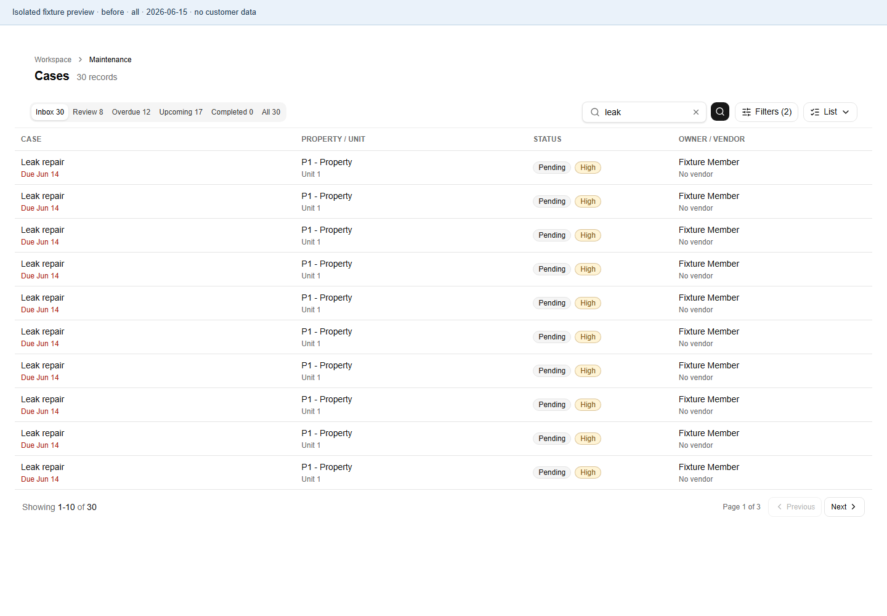
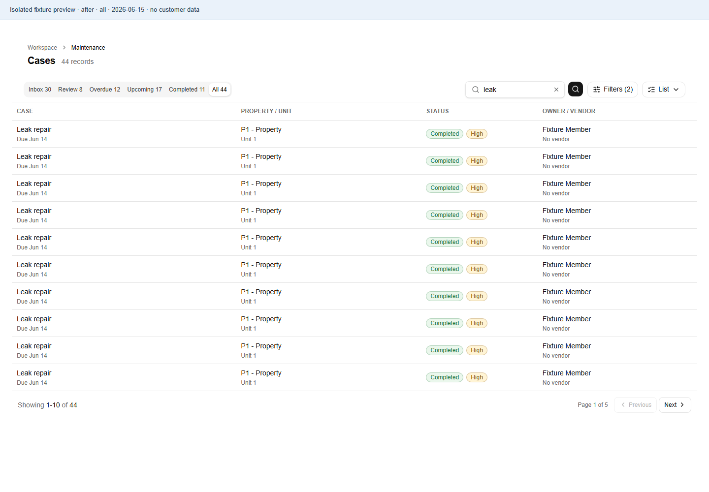
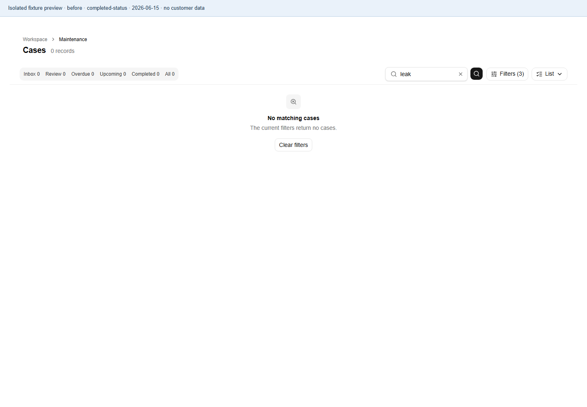
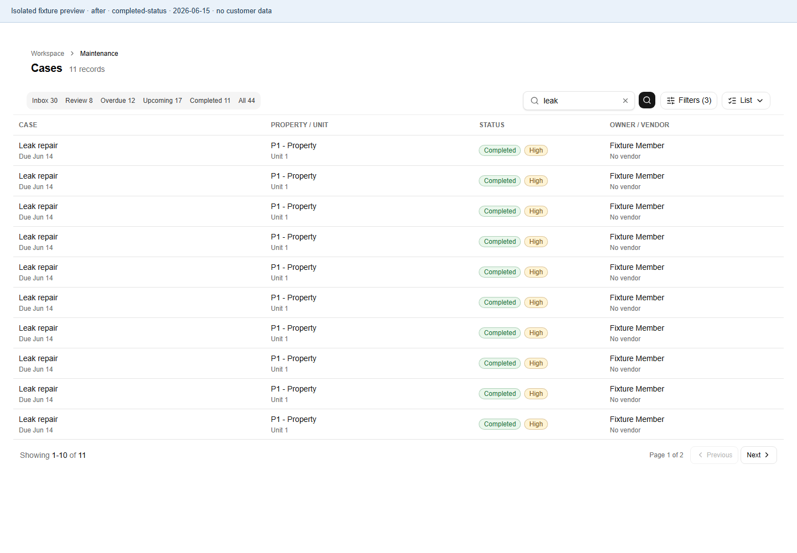
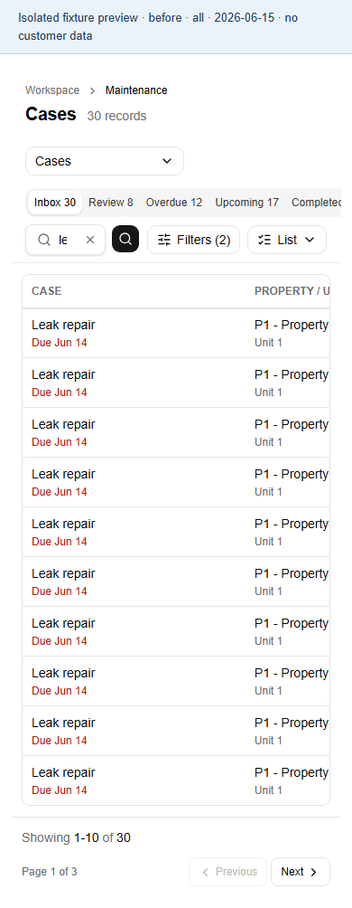
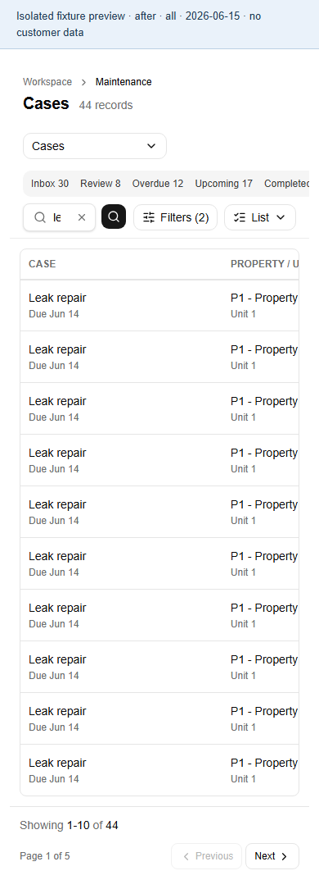

# Maintenance filters and queue counts

Verified on 2026-10-02. Before captures use unmodified main `e120f90f2ce8932362df36cf660d121f1e11a807`; after captures use PR198 with explicit Open retained by both Attention selectors.

All includes completed and cancelled records. Choosing Completed status returns completed records unless the user explicitly selects an incompatible attention filter. Saved queue badges count their destinations within the retained organization, actor, archive, property, unit, priority, search, and month scope. The displayed list summary remains filtered.

## Visible evidence

The same branch-scoped fixture contains 44 active matching records: 30 open, 11 completed, and 3 cancelled. The clock is fixed at `2026-06-15T12:00:00Z`. The assigned-person fixture in the regression suite contains 43 matching records because one open task belongs to another assignee.

| Request | Main before | PR198 after |
| --- | --- | --- |
| Explicit All | 30 records, resolves to Open | 44 records, resolves to All |
| Explicit Open | 30 records; All 30, Completed 0 badges | 30 records; All 44, Completed 11 badges |
| All with Completed status | 0 records | 11 records |
| Attention Open after Completed status | Open selection is lost at PR198's initial head | Explicit Open remains selected; the incompatible intersection is empty |

### All on desktop

| Before | After |
| --- | --- |
|  |  |

### Open on desktop

| Before | After |
| --- | --- |
|  |  |

### Completed status on desktop

| Before | After |
| --- | --- |
|  |  |

### All on mobile

| Before | After |
| --- | --- |
|  |  |

## Method and regression coverage

A temporary Vitest capture harness used the fixture client from `src/features/maintenance/data/maintenance.filtering.test.ts`, the real async Cases page, its real data loader, and its real screen. Auth context, database reads, portfolio search, and actions were replaced with isolated fixtures. No action mock was called. The resulting component DOM was rendered by Playwright with the application CSS at 1440 × 1000 and 390 × 844. These are local fixture previews; they do not establish a hosted authenticated end-to-end result.

Browser assertions checked record totals, returned page sizes, All and Completed badge text, and the All destination's retained filters and cleared status. The capture outputs are recorded in [before.json](maintenance-filter-counts-assets/before.json) and [after.json](maintenance-filter-counts-assets/after.json).

Nineteen clock-controlled data cases cover All, Open, Completed, queue-to-destination count equality, exact and stale pagination, zero matches, archive and focused-record scopes, Upcoming boundaries, assigned/branch/organization authority, counts beyond 1,000 rows, oversized owner search, and explicit Open plus Completed. Component and route tests cover both Attention controls, alternate view defaults, queue badges, status selection, navigation, and invalid review values.

An independent internal review found that selecting Open after a status filter dropped `review=open`. Five component regressions failed before the follow-up fix and passed afterward. The reviewer checked both callbacks across 120 route/view/status/control combinations and found no remaining blocking issue. Both selectors now preserve explicit review values while resetting pagination and retaining other filters.

No schema, timer, credentials, customer records, shared form internals, or financial behavior changed. Reminder lifecycle PR186 remains subject to its release order after PR188. PR198 remains a draft for coordinated release; exact-head CI evidence is linked from the PR description.
