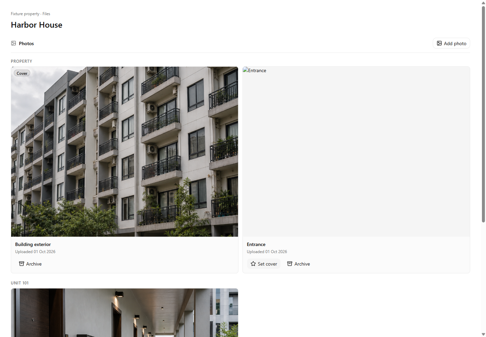
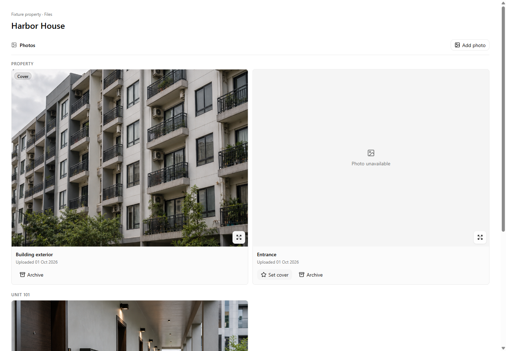
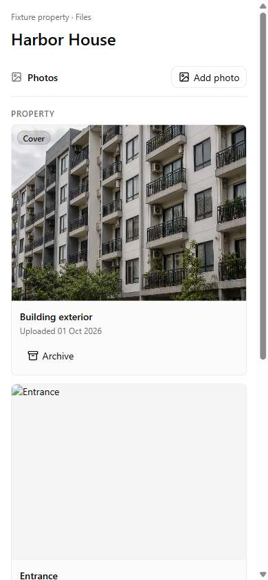
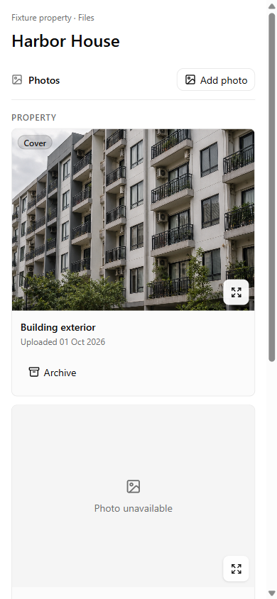
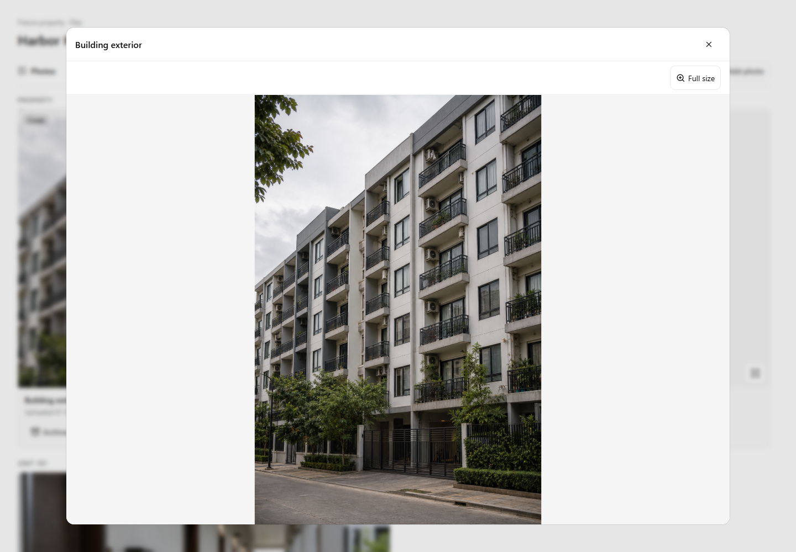
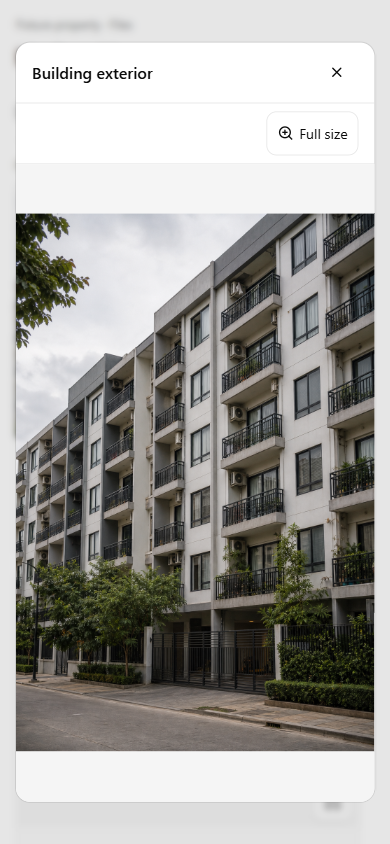
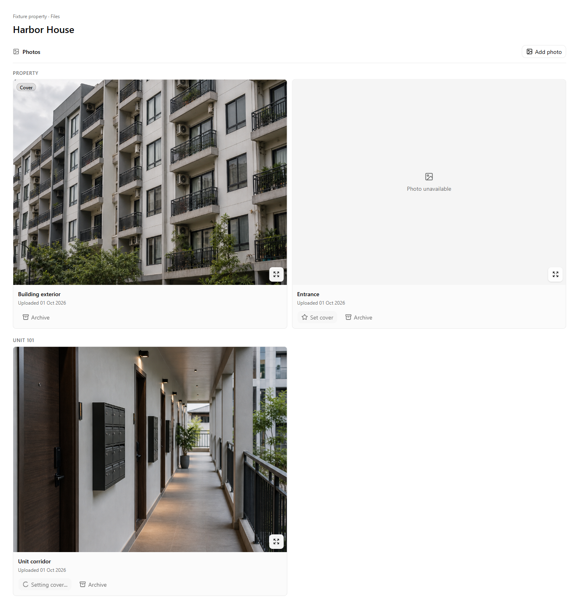
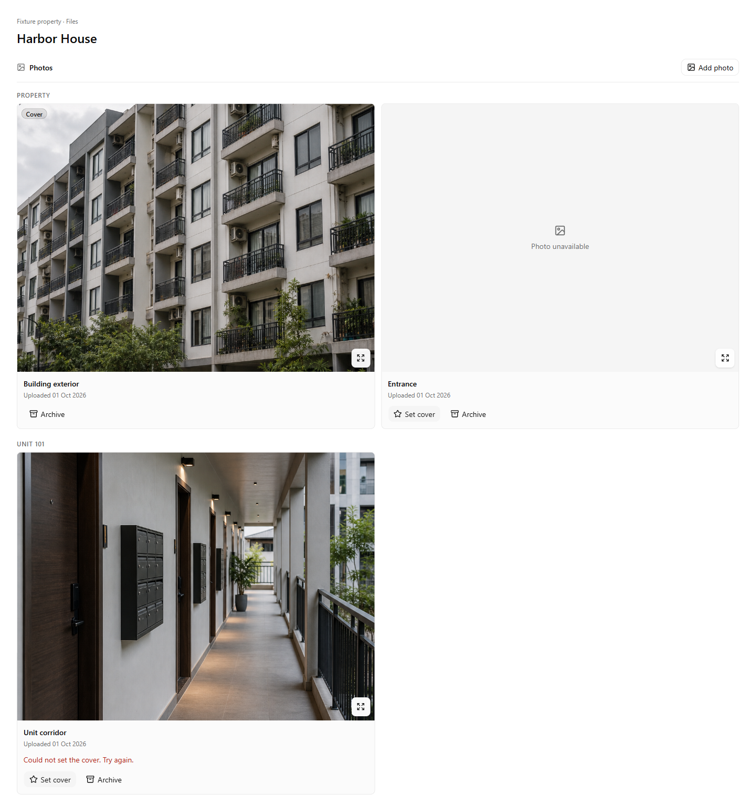

# Property photo viewer verification

Verified on 2026-10-01 from `codex/property-photo-viewer`, rebased onto main `1254e43b` after PR183 merged.

## Result

Property and unit photos open in an accessible dialog. The whole original photo fits the viewport; Full size shows its natural pixel dimensions in a scrollable region. Close, Escape, and backdrop dismissal return focus to the thumbnail. Viewing remains available to users without write permissions.

Set cover and Archive show pending labels, block repeated and competing requests within the gallery, and report confirmed success or a safe error beside the affected photo's actions. Failed actions leave the photo available for retry. Archive confirmation remains visible after the card disappears.

## Automated checks

- `npm run lint`: passed.
- `npx tsc --noEmit`: passed.
- `npx vitest run src/features/photos/components/photo-gallery.test.tsx src/features/photos/actions.test.ts src/features/organization/company-logo.test.ts`: 35 passed, including the released PR182 upload recovery cases.
- `npx vitest run src/features/properties/components/property-detail-screen.test.tsx src/features/properties/data/property-detail.test.ts src/features/units/components/unit-detail-screen.test.tsx src/components/ui/side-drawer-confirmation.test.tsx`: 46 passed.
- `node scripts/verify-repository-secrets.mjs`: passed.
- `git diff --check`: passed.

## Browser checks

Playwright CLI exercised the actual gallery, shared dialog components, Next.js Image, and app CSS in a local Vite fixture. Photo actions were replaced with controlled promises; images came from the repository's public marketing fixtures. No database or customer records were used. This verifies client behavior, not a hosted authenticated end-to-end flow.

- Desktop 1440 x 1000: uncropped original, Full size at native dimensions, arrow-key scrolling, Tab containment, Escape dismissal, restored focus.
- Mobile 390 x 844: contained dialog, 44 px viewer controls, full-size horizontal and vertical panning, fit toggle, backdrop dismissal, restored focus.
- Narrow mobile 320 x 568 and landscape 844 x 390: dialog remains inside the viewport; keyboard opening and Escape work.
- Viewer WCAG 2 A/AA and WCAG 2.1 AA axe scan: zero violations, 15 checks passed.
- Gallery with card-local action errors: zero WCAG violations, 14 checks passed.
- Delayed cover and archive: repeated clicks produced one request per attempt; other gallery actions stayed disabled while viewing remained available.
- Returned cover error and thrown archive error: readable feedback, safe text, successful retry, no premature cover change or removal.
- Successful archive: card removed and confirmation retained. Broken original: unavailable message and working Close.

Before captures render main's unmodified gallery; after captures render this branch with identical fixture data. All screenshots are local previews, not production captures.

| Desktop before | Desktop after |
| --- | --- |
|  |  |

| Mobile before | Mobile after |
| --- | --- |
|  |  |

| Desktop viewer preview | Mobile viewer preview |
| --- | --- |
|  |  |

| Pending cover | Failed cover |
| --- | --- |
|  |  |

## Existing check limitation

`node scripts/verify-ui-copy.mjs` fails on two occurrences already present in base main: `Owner payment` in `src/features/leases/actions.ts:1341`, and `Opening authority` in `src/features/reports/data/report-export-parity.test.ts:71`. No photo file was flagged. These unrelated files are unchanged.

The upload action and recovery logic, shared modal internals owned by PR183, company logo/report branding, property navigation, database schema, and security settings are unchanged. No merge, deployment, hosted data mutation, or manual external review was performed.
