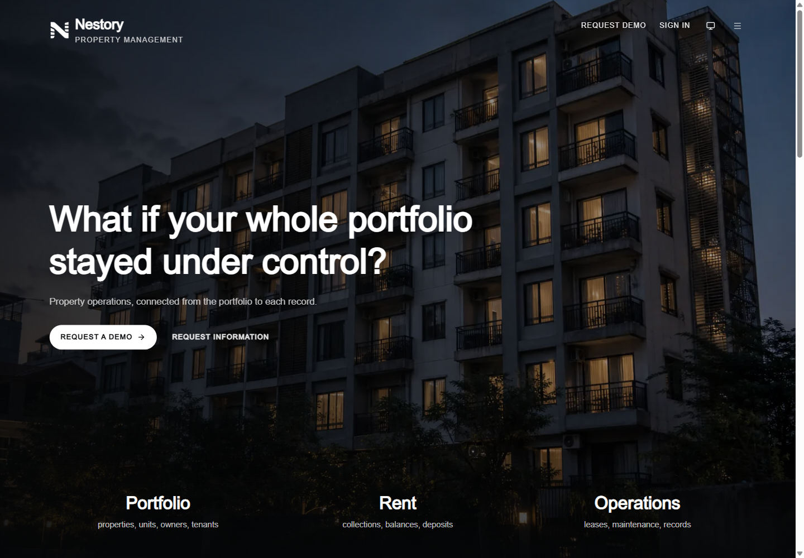
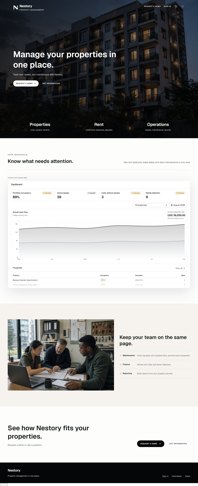
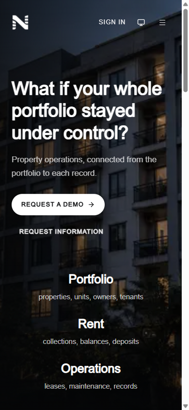
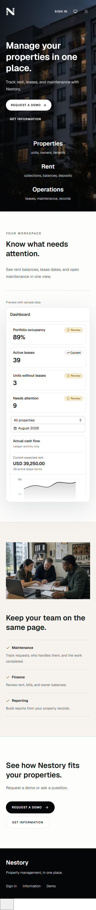
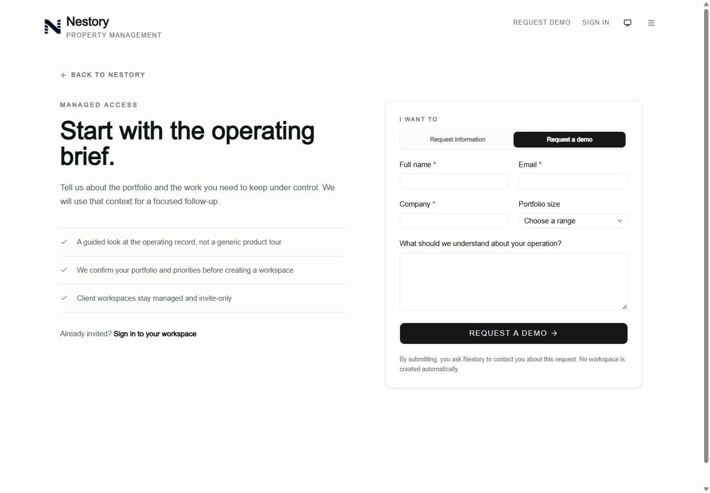
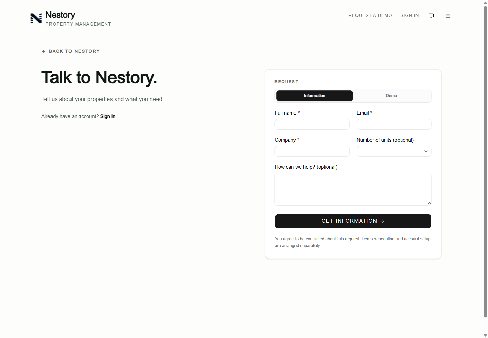
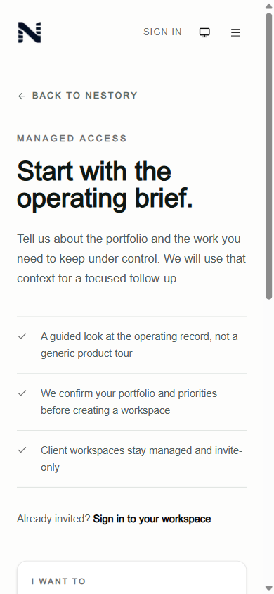
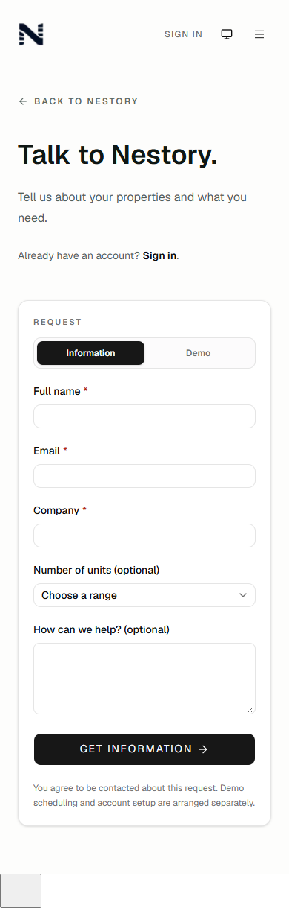

# Public landing and request flow

Verified on 2026-10-01 in an isolated local checkout. These are local previews, not production screenshots or a release confirmation. Before images use main `eddf073c`; after images use this branch, rebased onto main `1254e43b` (PR183).

## Changes

- Workspace and Operations scroll and receive keyboard focus after the menu finishes closing. Reopening, unmounting, or changing history cancels stale navigation. Repeat links avoid duplicate history entries. Cross-page section links and direct hashes receive focus too.
- Escape and Close preserve ordinary dialog focus restoration. Back to the hero returns focus to the menu button without overriding the browser's restored scroll position. The menu scrolls on short screens without overlapping the header.
- The landing page and request introduction use shorter, concrete copy. The dashboard preview is labeled as sample data. The phone request form starts within the first screen, instead of below a long introduction.
- Public forms retain entered details and the selected unit range after a rejected submission. Invalid fields or the save error receive focus. Pending submissions are locked. Navigating between demo and information URLs selects the correct intent.
- The confirmation no longer claims a follow-up has been queued. Demo scheduling and account setup are explicitly separate. The existing validation, rate limiter, honeypot behavior, and database command are unchanged.

## Evidence

The earlier live audit reported a changed hash with the viewport left at the hero. That exact scroll failure did not reproduce in local development: the baseline scrolled to Workspace (`scrollY=1016`, section top `-16px`) but left focus on the hidden Open menu button. After the fix, focus is on the selected section. The existing reveal animation accounts for the 16px section offset.

Local verification passed:

- `npx vitest run src/features/marketing src/app/request/page.test.tsx`: 6 files, 35 tests.
- `npx tsc --noEmit` and `npm run lint`.
- Repository secret scan and `git diff --check`.
- Chromium at 1440×1000, 390×844, and 667×320: section viewport/focus, keyboard activation, Escape, repeated hash, Back/Forward, history while the menu is open, reduced motion, short-screen scrolling, and section links from the request page.
- Both request intents: native required validation, server field validation, retained text and unit range, storage failure without false confirmation, and intent changes through same-route navigation.

Submission checks used `landing-fixture@example.invalid` and an unconfigured local server. Accepted/pending confirmation states and database responses were tested with mocked actions/RPC fixtures. No real leads or customer records were submitted. Authenticated shared components, database/security configuration, and migrations were not modified.

The repo-wide `test:ui-copy` check has two pre-existing failures, also present on main: `src/features/leases/actions.ts` ("Owner payment") and `src/features/reports/data/report-export-parity.test.ts` ("Opening authority"). They are outside this change. Local development also reported blocked Next devtools styles and used fallback fonts because Google Fonts was unavailable; these captures do not establish production console or font behavior.

## Before and after

| View | Before: local main | After: local branch |
| --- | --- | --- |
| Landing, desktop |  |  |
| Landing, phone |  |  |
| Request, desktop |  |  |
| Request, phone |  |  |

[Workspace after navigation](../../artifacts/public-entry-flow/after-workspace-navigation.png) · [Short-screen menu scrolled to its final link](../../artifacts/public-entry-flow/after-menu-short-screen.png)
